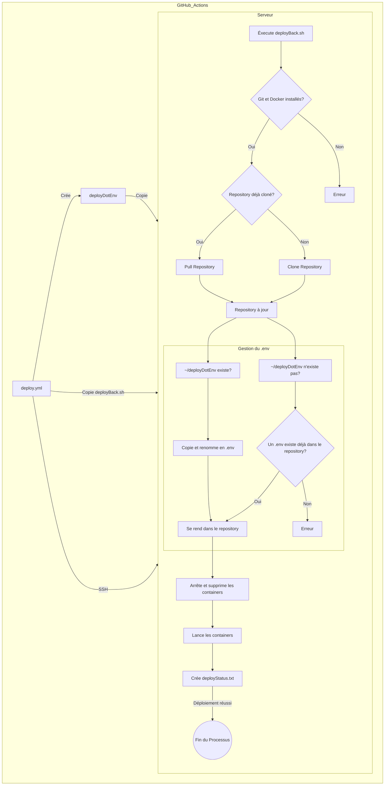

# Documentation du déploiement automatique du Backend de Constellation par Github Actions

## Prérequis

- Un serveur distant (VPS, serveur dédié, etc.) avec une distribution Linux (Ubuntu 20.04 LTS ou plus récent recommandé)
- Docker et Docker Compose installés sur le serveur
- Git configuré avec les permissions nécessaires pour cloner et pull le repot
- Un utilisateur avec les droits sudo sans mot de passe (pour lancer les commandes Docker)

## Github Action pour le déploiement

Le déploiement du backend de Constellation est automatisé via Github Actions.
La github action est définie dans le fichier `.github/workflows/deploy.yml` du repository.

### Étapes de la Github Action

1. Cloner le repository sur le serveur distant (checkout)
2. Mettre en place la clé SSH pour ce connecter au serveur distant (ssh-key récuperée via les secrets de Github)
3. Créer le fichier `.env` à partir des secrets de Github puis le copier sur le serveur distant
4. Copier le script de déploiement `deployBack.sh` sur le serveur distant
5. Exécuter le script de déploiement

### Secrets de Github

Pour que la Github Action fonctionne, il faut ajouter les secrets suivants dans les secrets du repository:

- `secrets.DEPLOY_IP`: L'adresse IP du serveur distant
- `secrets.DEPLOY_USER`: L'utilisateur pour se connecter au serveur distant
- `secrets.EPITECH_REPO_SSH_KEY`: La clé SSH privée pour se connecter au serveur distant
- `secrets.DEPLOY_ENV_PIPENV_VENV_IN_PROJECT`: La variable d'environnement `PIPENV_VENV_IN_PROJECT` qui sera mise dans le fichier `.env` du serveur distant par la Github Action
- `secrets.DEPLOY_ENV_TARGET`: La variable d'environnement `TARGET` qui sera mise dans le fichier `.env` du serveur distant par la Github Action
- `secrets.DEPLOY_ENV_POSTGRES_USER`: La variable d'environnement `POSTGRES_USER` qui sera mise dans le fichier `.env` du serveur distant par la Github Action
- `secrets.DEPLOY_ENV_POSTGRES_PASSWORD`: La variable d'environnement `POSTGRES_PASSWORD` qui sera mise dans le fichier `.env` du serveur distant par la Github Action
- `secrets.DEPLOY_ENV_POSTGRES_HOST`: La variable d'environnement `POSTGRES_HOST` qui sera mise dans le fichier `.env` du serveur distant par la Github Action
- `secrets.DEPLOY_ENV_POSTGRES_PORT`: La variable d'environnement `POSTGRES_PORT` qui sera mise dans le fichier `.env` du serveur distant par la Github Action
- `secrets.DEPLOY_ENV_POSTGRES_DB`: La variable d'environnement `POSTGRES_DB` qui sera mise dans le fichier `.env` du serveur distant par la Github Action
- `secrets.DEPLOY_ENV_JWT_SECRET_KEY`: La variable d'environnement `JWT_SECRET_KEY` qui sera mise dans le fichier `.env` du serveur distant par la Github Action

## Script de déploiement

Le script de déploiement `deployBack.sh` est exécuté sur le serveur distant par la Github Action.

### Étapes du script de déploiement

1. Vérifier que git et docker sont installés sur le serveur
2. Vérifier si le repository a déjà été cloné sur le serveur
   - Si oui, pull le repository
   - Si non, cloner le repository
3. Copier le fichier `.env` depuis celui créé par la Github Action (deployDotEnv) dans le repository
   - Si le fichier `~/depoyDotEnv` est présent sur le serveur, il sera copié et renommé en `.env` dans le repository
   - Sinon, si le fichier `~/depoyDotEnv` n'est pas présent:
     - ET que le repository contient déjà un fichier `.env`, on continue
     - ET que le repository ne contient pas de fichier `.env`, on arrête le déploiement
4. Se rendre dans le repository cloné
5. Arrêter et supprimer les containers Docker existants (`docker compose down`)
6. Lancer les containers Docker (`docker compose up -d`)
7. Créer un fichier `deployStatus.txt` pour indiquer que le déploiement a été effectué et à quelle date

## Diagramme de déploiement

