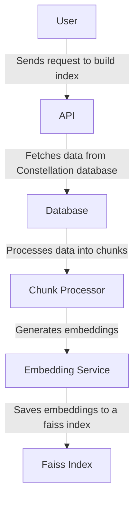
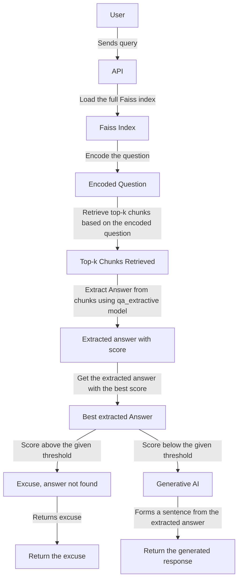

# Structure of the RAG AI

This document provides an overview of the structure of the RAG AI in the Constellation project, including how it interacts with the database, builds indexes, retrieves, and generates answers.

## Index building Graph

## Retrieval and Generation

